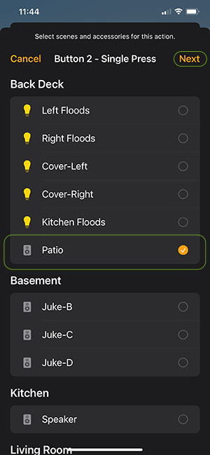
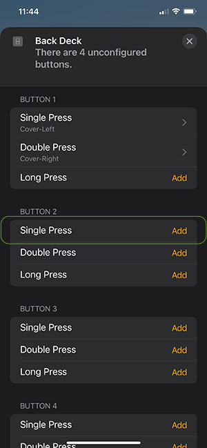
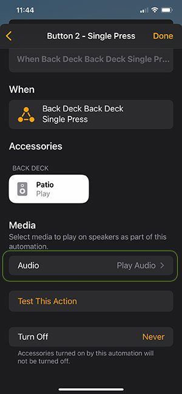
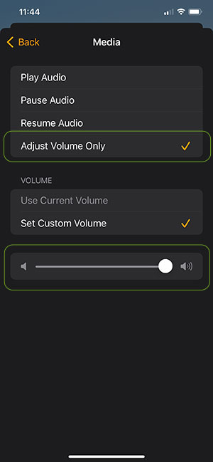
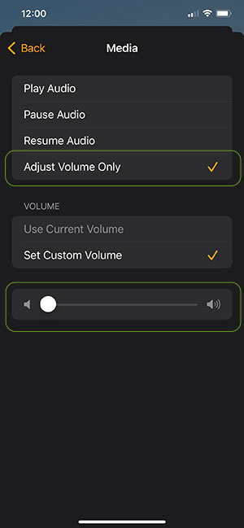

# Homebridge Juke Audio Plugin


This Homebridge plugin controls Juke Audio Multi-Room Streaming Amplifiers (https://jukeaudio.com/). The Juke amplifiers allow wireless streaming from devices such as a phone to the amplifier. The amplifier then distributes the audio to a series of speakers.

The Juke Audio plugin creates an Apple Homekit "Speaker" for each amplifier zone. This allows you to perform the following actions:
- Change the volume up or down

Future versions will look to add support for:
- Mute the volume
- Change zone (i.e., speaker) source

Note that because there is not a direct correllation between Jukes features and an Apple Homekit Speaker, not all functionality is supported. For example, it is not possible to pause/play an audio source.

Additionally, Apple Homekit 'Speakers' are intended to be 'smart' speakers such as a Sonus speaker or Apple HomePod. As such, the Juke system doesn't fully align with the feature set.  The Juke Audio Plugin is essentially attempting to fit a square peg (Juke) into a round hole (Apple Homekit Speaker).

One oddity about the way Homekit handles speakers is if there isn't a configured audio source for a speaker, you are not allowed to control the volume. Therefore, the only way to control the volume for a Juke Zone/Speaker is with a configured HomeKit automation. For example, 'turn the audio off when you leave home'. My intent for building this plugin was to use Lutron Pico remotes to trigger volume commands so it is optimized around that scenario. Please let me know if there are additional scenarios you are trying to address and I'll see if I can accommodate them.

The initial intention of this plugin was to interface it with a low-cost Lutron Pico Smart Audio Remote (https://www.casetawireless.com/us/en/products/pico-remotes). Placing a Pico audio remote on the wall where speakers are located allows easy volume control of the speakers.  Otherwise, a phone, tablet or computer is required to set the volume.  The Lutron Pico has a HomeBridge plugin (Lutron Caseta LEAP) you can install (https://github.com/thenewwazoo/homebridge-lutron-caseta-leap#readme) and configure to control the Juke.

## Installation & Plugin Configuration
Install the plugin as you would any other Homebridge plugin.

Use the UI settings to set the password and name or manually make the changes in the config file as follows:

Use the following configuration:
```
        {
            "name": "Juke",
            "platform": "JukeAudioPlugin",
            "password": "Admin"
        }
```

Juke publishes it's local device name on the network as 'juke.local' so it should find the device automatically. Specify the password (Jukes default password is 'Admin'). Keep the 'name' and 'platform' values the same as shown above.

After you change the configuration, restart Homebridge.

## Apple Homekit Configuration
Apple treats Homekit Speakers differently than most other devices and as a result there are some additional steps that must be done in order for them to appear in Homekit.

Go to the Homebridge 'Status' page and inspect the log output. You should see something like the following for each Juke Zone you have. Take note of the 'Setup Code' referenced for each of the Speaker Zones.

```
[7/8/2023, 11:20:52 AM] [Juke] Registering Zone:  Patio...
[7/8/2023, 11:20:52 AM] [Juke] Zone Registered: Patio (8D4F75-607-Z0)
[7/8/2023, 11:20:52 AM] [Juke] Registering Zone:  Upstairs Hall...
[7/8/2023, 11:20:52 AM] [Juke] Zone Registered: Upstairs Hall (8D4F75-607-Z1)
[7/8/2023, 11:20:52 AM] [Juke] Registering Zone:  Living Room...
[7/8/2023, 11:20:52 AM] [Juke] Zone Registered: Living Room (8D4F75-607-Z2)
[7/8/2023, 11:20:52 AM] Patio DFBA is running on port 49490.
[7/8/2023, 11:20:52 AM] Please add [Patio DFBA] manually in Home app. Setup Code: 407-54-639
[7/8/2023, 11:20:52 AM] Upstairs Hall A642 is running on port 49491.
[7/8/2023, 11:20:52 AM] Please add [Upstairs Hall A642] manually in Home app. Setup Code: 407-54-639
[7/8/2023, 11:20:52 AM] Living Room 1463 is running on port 49492.
[7/8/2023, 11:20:52 AM] Please add [Living Room 1463] manually in Home app. Setup Code: 407-54-639
```

### Add Speaker in the Home App
1. Open the Home App on your phone
2. Choose the '+' button at the top and choose 'Add Accessory'
3. Choose the 'More options...' link
4. If the accessory is listed then select it, otherwise choose the button that says "My Accessory Isn't Shown Here"
5. Choose the option for "Enter Code" manually
6. Enter the Setup Code that was listed in the Homebridge logs
7. Complete the setup for the speaker zone
8. Repeat the process for each Speaker zone

## Configuration of Lutron Pico Remotes
If you wish to control the volume via a Lutron Pico remote, you must configure the Pico remote in a specific way so that Juke can respond to the button clicks correctly.

First, you must install the "Lutron Caseta LEAP" Homebridge Plugin and configure that before you can attempt to link the Pico with a Juke zone.

Once you have configured the Lutron Caseta LEAP plugin and the Pico remotes are shown within the Apple Home app you can continue with the configuration.

1. Tap on the Pico remote accessory in the Home app to display the device details.
2. Select the Juke zone you wish to associate with the remote (see highlight in green) and then choose 'Next'.

3. Configure the "Volume Up" button by selecting 'Single Press' item for "Button #2" as shown in the image below.

4. Tap the 'Audio' button as shown in the green highlight.

5. Select "Adjust Volume Only" and set the volume to MAXIMUM. NOTE: This is super important that you set the volume to maximum. If you set it to anything else then it will not work. When Juke receives a command to set the volume to maximum it interprets it as a "Volume Up" and does the right thing.

6. Choose 'Back' until you get to the button configuration page.
7. Configure the "Volume Down" button by selecting 'Single Press' item for "Button #4".
8. Tap the 'Audio' button as you did previously while setting the volume up configuration
9. Select "Adjust Volume Only" and set the volume to MINIMUM as shown in the example below. NOTE: This is super important that you set the volume to minimum. If you set it to anything else then it will not work. When Juke receives a command to set the volume to minimum it interprets it as a "Volume Down" and does the right thing.
